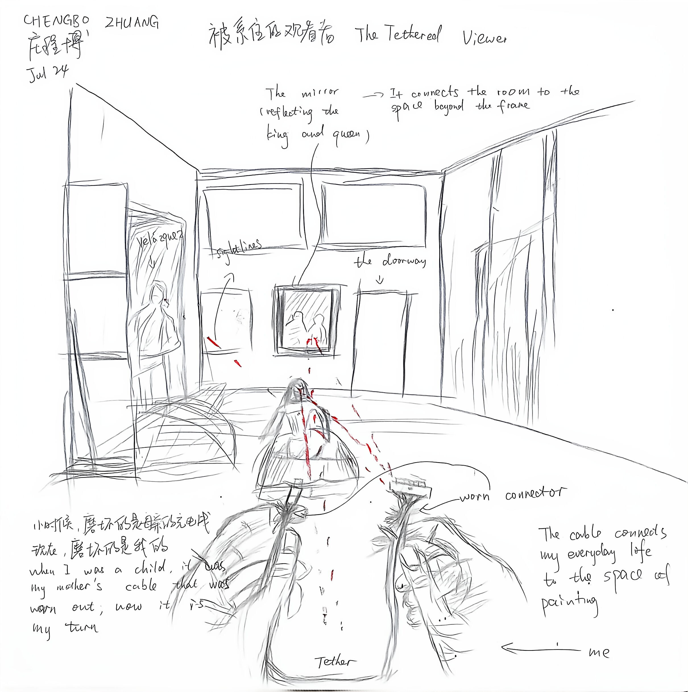
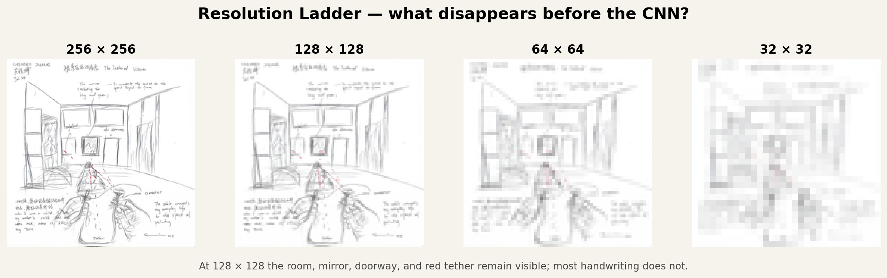
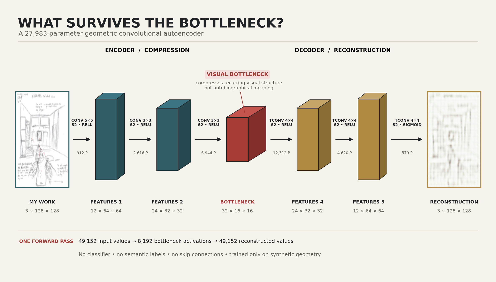
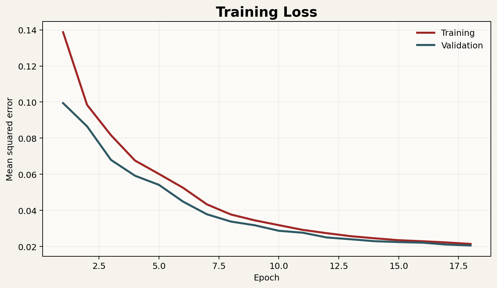
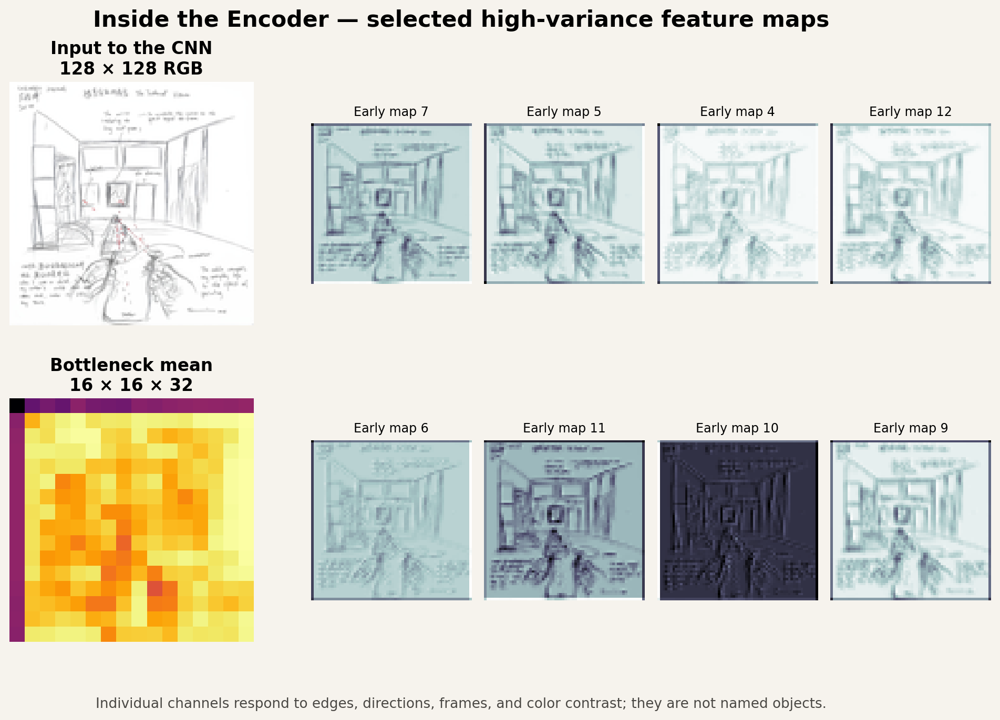

# 走进《宫娥》：一幅画如何改变了我观看艺术的方式

## 什么能穿过瓶颈？几何自编码器如何观看《被系住的观看者》

[English](submission/README-en.md) · [双语入口](README.md)

## 项目概述

这个实验是我的课程项目 _Entering Las Meninas: How a Painting Changed the Way I Look at Art_ 的神经网络部分。项目的主要分析对象不是委拉斯开兹的原作本身，而是我在观看《宫娥》之后创作的作品《被系住的观看者》（_The Tethered Viewer_）。

《宫娥》让我意识到，观看并不是从画外单向地观察画内。画中的镜子、门洞、画框、视线和人物朝向不断把观看者拉进画面。我在自己的作品中把这种关系转化为一根红色系绳：它既连接画面中的人物，也连接我的观看经验，以及我小时候对旧网线的记忆。

老师在 office hour 中建议我们降低图像分辨率，让作品通过一个 CNN，或者经过一个简单的编码器和解码器，再观察几何结构发生了什么。因此我没有继续使用复杂的风格迁移或多阶段计算机视觉系统，而是训练了一个只有 27,983 个参数的小型卷积自编码器。

核心问题是：

> 当《被系住的观看者》被缩小到 128 × 128 像素，并穿过一个只学习过简单几何图案的卷积自编码器时，哪些视觉关系能够被重建，哪些个人意义会消失？



_图 0｜《被系住的观看者》。房间结构、镜面、门洞、人物和红色系绳重新组织了我从《宫娥》中感受到的观看关系。_

## 一句话结论

> 编码器压缩的是反复出现的视觉规律，而不是我赋予这些规律的个人意义。

网络可以强化边缘、方向、画框和连接等形式关系，但它不知道红线为什么与我的记忆有关。机器获得的是一种选择性的视觉清晰，而不是人的理解。

## 实验流程

整个实验只有一条主线：

```text
降低作品分辨率
        ↓
用简单几何图案训练小型卷积自编码器
        ↓
让我的作品通过编码器、瓶颈和解码器
        ↓
观察重建、差异和中间特征
        ↓
把《宫娥》送入同一个网络进行克制的对照
```

正式运行参数如下：

| 项目         |            数值 |
| ------------ | --------------: |
| 模型输入     |   3 × 128 × 128 |
| 合成训练图案 |          800 张 |
| 训练轮数     |              18 |
| 批量大小     |              32 |
| 学习率       |           0.001 |
| 可训练参数   |          27,983 |
| 损失函数     | 均方误差（MSE） |
| 随机种子     |             139 |

## 1. 降低分辨率：神经网络之前已经失去了什么？

原始作品尺寸为 2420 × 2436。实验先把它分别缩小到 256、128、64 和 32 像素，再用最近邻放大显示像素结构。



_图 1｜分辨率阶梯。它把普通缩放造成的损失与神经网络瓶颈造成的损失区分开。_

在 256 × 256 时，大部分手写文字和人物细节仍可辨认。到 128 × 128 时，房间轮廓、中央镜面、右侧门洞、前景人物和红色系绳仍然存在，但文字内容已经难以阅读。64 × 64 主要保留空间分区和粗线条；32 × 32 则只剩下大致明暗和位置关系。

我最终选择 128 × 128，是因为这个尺寸仍能保留作品的基本构图，却已经迫使观看者承认：在 CNN 开始工作之前，一部分叙事信息已经被分辨率消除了。因此，后面的信息损失不能全部归因于神经网络。

## 2. 网络学习了什么？

训练集不是现实照片，也不包含《宫娥》或我的作品。程序生成 800 张简单几何图案，其中包括：

- 房间式透视线与消失点；
- 画框、镜面和门洞式嵌套矩形；
- 网格、弧线和放射状连接；
- 少量红色折线和节点。


_图 2｜合成训练集样本。模型只从这些框架、方向、曲线和红色连接中学习重建。_

这些图案故意很简单。它们不是为了模拟艺术史，而是为了给网络建立一个清楚、可解释的视觉词汇。红色折线与我的系绳有关，但它们没有任何个人故事；网络只会学到“某些线条具有红色，并连接几个位置”。

这种训练设计让后面的结果更容易解释：如果网络重建了画框或对角线，我们可以说这些结构接近它反复见过的模式；如果它没有重建文字和人物身份，也不能说网络“忘记了”意义，因为它从未学习过那些意义。

## 3. 网络结构：压缩与重建

模型由三层卷积编码器和三层转置卷积解码器组成。空间尺寸依次从 128 缩小到 64、32 和 16，再被放大回 128。通道数量先从 3 增加到 32，使网络能够在不同通道中记录不同的视觉响应。



_图 3｜用于课堂展示的模型结构。箭头上的卷积核、步长、激活函数和参数量来自真实模型，而不是手工估计。_

编码器中的三个张量尺寸为：

```text
3 × 128 × 128
    ↓ Conv 5×5, stride 2, ReLU
12 × 64 × 64
    ↓ Conv 3×3, stride 2, ReLU
24 × 32 × 32
    ↓ Conv 3×3, stride 2, ReLU
32 × 16 × 16  ← 视觉瓶颈
```

解码器使用三层转置卷积逆转空间压缩，最后通过 Sigmoid 把像素限制在 0 到 1 之间。整个模型没有分类器、语义标签或跳跃连接。输入包含 49,152 个数值，瓶颈包含 8,192 个激活值；它不是把图像压成一个单词，而是把空间信息压成较小的多通道网格。

下面的 `torchview` 图是程序运行一次前向传播后自动记录的真实结构。由于横向结构很宽，可以点击图片打开 SVG 版本并放大。

[](outputs/06-torchview-network.svg)

_图 4｜自动追踪结构图。虚线框分别表示编码器和解码器的顺序模块。_

## 4. 训练是否真正收敛？



_图 5｜18 轮训练与验证损失。两条曲线持续下降并在后期接近。_

训练损失从 0.138695 下降到 0.021439，最终验证损失为 0.020588。验证曲线没有在后期明显上升，因此这次运行没有表现出显著的过拟合反弹。曲线只能证明模型越来越擅长重建同类合成几何图案，不能证明它理解了我的作品。

## 5. 我的作品穿过瓶颈之后发生了什么？


_图 6｜从左到右：128 × 128 输入、编码器—解码器重建、绝对差异，以及红色优势输入减输出。_

重建结果保留了房间的大框架、中央矩形区域、人物的大致位置和部分方向关系，但线条变得柔软、模糊并带有网格式纹理。手写文字、人物轮廓和局部叙事细节受到更强的损失。

第三幅差异图在原有线条、文字和人物边缘处最亮，说明网络最难重建的正是高频、局部而不规则的内容。房间的长直线虽然也有误差，但整体空间分区仍可辨认。

第四幅图专门比较红色优势。暖色表示输入比输出更红，主要落在真实系绳的位置，说明系绳局部被削弱；浅蓝色表示输出在原本没有强红色关系的区域加入了微弱红色倾向。这个现象表明，网络没有保存“我的那根红线”，而是把训练中学到的“红色连接应该出现”的统计先验扩散到了图像中。

## 6. CNN 如何把视觉模式分开？



_图 7｜输入、八个高方差早期特征通道，以及 16 × 16 × 32 瓶颈的通道平均图。_

不同通道对相同作品产生不同强度的响应。有些通道强调暗线和边界，有些强调浅色背景中的局部变化，还有一些对中央人物、房间竖线或文字区域更加敏感。这可以帮助理解老师所说的“separate them”：卷积网络不会把整幅图当成一个不可分割的对象，而是把边缘、方向、颜色反差和局部组合分布到不同通道。

但这些通道没有自然语言名称。把某个通道直接叫作“镜子通道”或“意义通道”会过度解释。图中显示的是数值激活，不是模型对画面所作的文字判断。

## 7. 一次真实前向传播


_图 8｜我的作品从输入经过三次编码、瓶颈和两次中间解码，最终成为重建图像。_

这张图不是一般性的网络示意，而是《被系住的观看者》实际通过训练模型时产生的中间结果。每个热图都是该层所有通道的平均值，并独立归一化，因此颜色只能用于观察同一张图内部的相对激活，不能跨面板直接比较绝对数值。

在 64 × 64 和 32 × 32 的编码阶段，房间、中央矩形和前景人物仍然较为清晰。到了 16 × 16 的瓶颈，具体线条被压缩为空间块和粗略区域。解码器可以把这些块重新扩展，却不能恢复已经丢失的手写内容。它生成的是符合训练规律的近似，而不是从隐藏位置找回原图。

## 8. 为什么还要让《宫娥》通过同一个网络？


_图 9｜同一个几何自编码器处理我的作品与《宫娥》。每行依次为输入、重建、早期响应和瓶颈平均。_

这个对照不是为了计算两幅作品的“艺术相似度”，而是为了观察同一个受限的几何滤镜如何面对两种相关但视觉分布不同的图像。

我的作品是浅色纸面上的线性素描，与合成训练图案比较接近；《宫娥》是深色、色彩复杂的油画，远离训练分布。因此网络对我的作品的重建均方误差为 0.003884，而对《宫娥》的误差为 0.036573。这个差距不代表我的作品更好、更简单或更容易被理解。它首先说明训练材料决定了模型习惯什么样的亮度、颜色和线条。

尽管如此，早期响应中仍能看到两幅图共同拥有的框架、开口、垂直线、人物群与纵深组织。这让原作与我的改编发生一种有限但有意义的联系：网络无法理解我为什么重新画《宫娥》，却可以在低层视觉上暴露两幅图共享的空间语法。

## 9. 定量结果与正确读法

| 指标                | 我的作品 | 《宫娥》原作 |
| ------------------- | -------: | -----------: |
| 重建均方误差        | 0.003884 |     0.036573 |
| 重建平均绝对误差    | 0.048645 |     0.172533 |
| 红色优势输入能量    |   7.9647 |     870.5470 |
| 红色优势输出能量    | 110.6619 |    1246.1748 |
| 输出/输入红色能量比 |  13.8940 |       1.4315 |

这些数值描述的是这个特定模型的压缩误差，不是美学评价。尤其是我的作品中 13.894 的红色比值不能被称为“红线保留率”：如果是忠实保留，红色应该主要停留在原有系绳位置；实际结果却包含大范围微弱红色偏移。因此，高比值更适合解释为模型先验的扩散。

## 10. 艺术、几何与认知

这个实验最终不是关于如何让 AI 替我解释《宫娥》，而是关于不同观看者如何丢弃不同的信息。

人观看作品时，可以把一条红线连接到童年、身体位置、观看经验和艺术史。自编码器观看作品时，会把图像分解成局部卷积响应，并优先重建训练中反复出现的结构。它的瓶颈使画框、方向和区域关系变得突出，同时让文字、人物身份和回忆变得不可恢复。

这与《宫娥》对我的影响形成呼应。委拉斯开兹的画让我意识到观看者的位置并不稳定；神经网络实验进一步让我意识到，任何观看方式都有自己的瓶颈。人和机器都不是保存一切的中立观察者，但两者丢弃信息的原因不同。机器受训练分布、分辨率和损失函数限制；人的观看则被记忆、文化和身体经验塑造。

## 11. 方法限制

- 合成训练图案不是现实图像数据集，因此模型只能作为一次受控的视觉实验。
- 128 × 128 的输入本身已经损失大量文字细节，不能把全部损失归因于 CNN。
- 通道平均热图会隐藏单个通道之间的差异，并且不是注意力图。
- 两张作品不能支持普遍性的艺术史结论。
- 重建误差只能衡量像素差异，不能衡量意义、作者身份或艺术质量。
- 红色优势能量对整体色调敏感，因此必须结合差异图解释。

这些限制不是应该隐藏的缺陷，而是本项目结论的一部分：小型神经网络能够让形式结构变得清楚，同时暴露“看见结构”和“理解意义”之间的距离。

## 12. 如何复现实验

进入本目录后安装依赖：

```bash
python -m pip install -r requirements.txt
```

Graphviz 的 `dot` 命令用于生成自动结构图。Mac 如未安装：

```bash
brew install graphviz
```

重新训练模型并生成图 1、2、5、6、7、9：

```bash
python autoencoder-experiment.py
```

读取训练模型并生成图 3、4、8以及结构 JSON：

```bash
python network-visualization.py
```

把组合图中的面板、全部 800 张训练图案和专门的输入—重建比较材料分别导出：

```bash
python export-individual-images.py
```

分类目录和比较方法见 [`outputs/individual/README.md`](outputs/individual/README.md)。

脚本使用固定随机种子 139，并自动优先选择 Apple MPS；MPS 不可用时会回退到 CPU。

## 13. 文件索引

| 文件                                | 内容                           |
| ----------------------------------- | ------------------------------ |
| `My_Own_Work.png`                   | 我的作品原图                   |
| `inputs/las-meninas-reference.jpg`  | 《宫娥》参考图                 |
| `autoencoder-experiment.py`         | 数据生成、模型训练和主要分析   |
| `network-visualization.py`          | 网络结构与逐层传播可视化       |
| `export-individual-images.py`       | 分类单图、全部训练图案和重建比较材料 |
| `model/geometric-autoencoder.pt`    | 模型权重、配置和训练历史       |
| `outputs/metrics.json`              | 重建与红色优势指标             |
| `outputs/network-architecture.json` | 每层尺寸、卷积核、步长和参数量 |
| `outputs/01`—`08`                   | 本文使用的全部输出图片         |
| `outputs/individual/`               | 按分辨率、特征阶段和比较用途分类的单图 |
