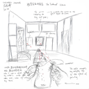
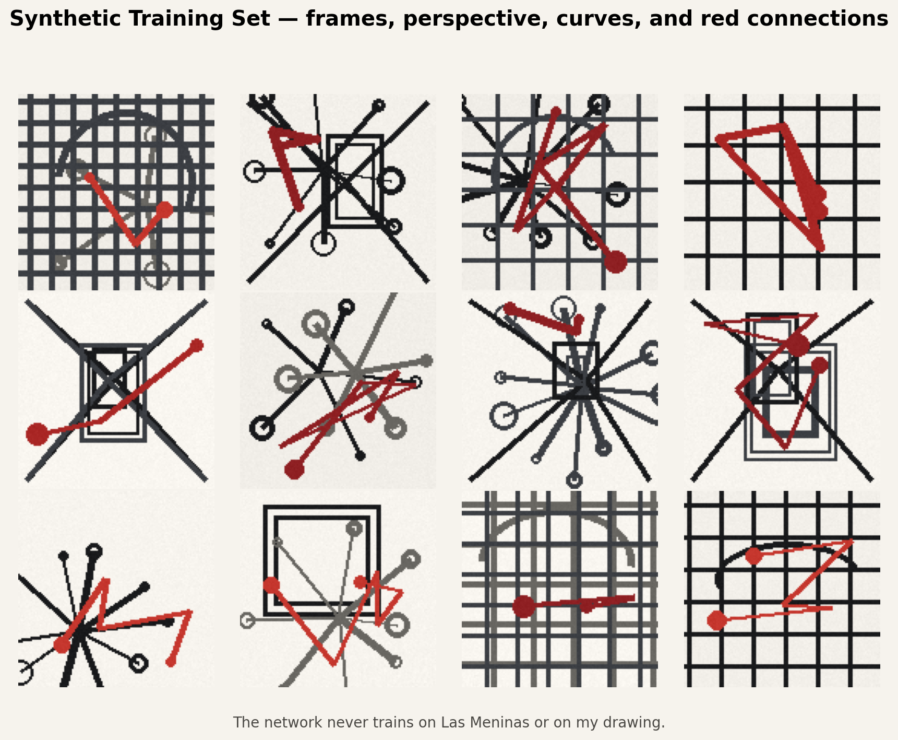
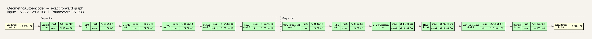
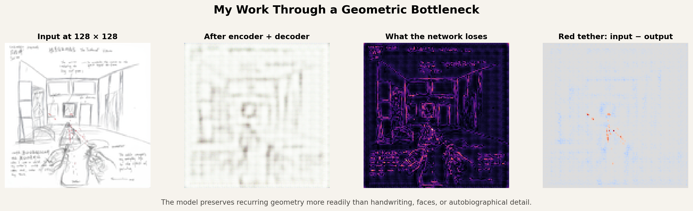
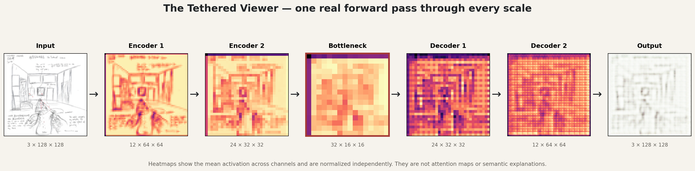
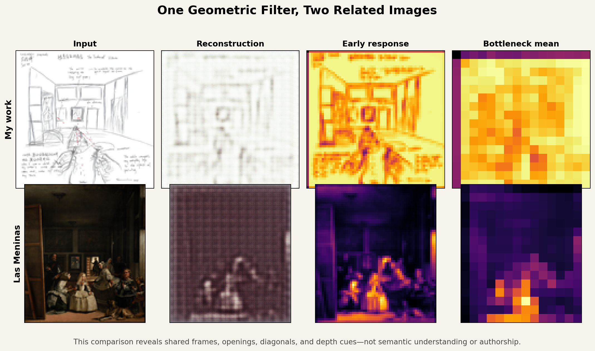

# Entering *Las Meninas*: How a Painting Changed the Way I Look at Art

## What Survives the Bottleneck? A Geometric Autoencoder Reads *The Tethered Viewer*

**COGSCI 139 — Art, Geometry, and Cognition · Second Delivery**

## Files to Submit

The two required, fully executed Python notebooks are:

1. [`01-all-layer-outputs.ipynb`](01-all-layer-outputs.ipynb) — follows the selected image through all 12 leaf layers and examines every intermediate output.
2. [`02-autoencoder-reconstruction.ipynb`](02-autoencoder-reconstruction.ipynb) — passes the selected image through the encoder, bottleneck, and decoder, then compares the reconstruction with the input.

Both notebooks have been executed from top to bottom. Their code-cell outputs and figures are embedded, their final validation cells pass, and neither notebook contains an error output. The notebook code remains readable because the artwork and trained checkpoint are stored separately in the neighboring `assets/` folder.

## Project Overview

This experiment is the neural-network component of my course project, *Entering Las Meninas: How a Painting Changed the Way I Look at Art*. Its primary subject is not Velázquez’s original painting by itself, but my own work, *The Tethered Viewer*, which I made in response to *Las Meninas*.

The painting taught me that looking is not a one-way action performed by a viewer who remains safely outside the image. The mirror, doorway, canvas, sightlines, and figures in *Las Meninas* repeatedly pull the viewer into the represented space. In my work, I translated that relationship into a red tether. It connects figures inside the drawing, but it also connects my experience of looking with a childhood memory of an old network cable.

During office hours, the instructor suggested lowering the image resolution, passing the work through a CNN, or using a simple encoder and decoder to observe what happens to its geometry. I therefore moved away from a complicated style-transfer or multi-stage computer-vision pipeline and trained a small convolutional autoencoder with only 27,983 trainable parameters.

The central question is:

> When *The Tethered Viewer* is reduced to 128 × 128 pixels and passed through a convolutional autoencoder trained only on simple geometric patterns, which visual relationships can be reconstructed, and which forms of personal meaning disappear?



*Figure 0 | The Tethered Viewer. The room, mirror, doorway, figures, and red tether reorganize the relationships of looking that I experienced in Las Meninas.*

## One-Sentence Conclusion

> The encoder compresses recurring visual patterns, not the personal significance I attach to them.

The network can make edges, directions, frames, and connections more visible, but it does not know why the red line matters to my memory. What the machine gains is a selective kind of visual clarity, not human understanding.

## Experimental Workflow

The experiment follows one deliberately simple path:

```text
Lower the resolution of my work
        ↓
Train a small convolutional autoencoder on simple geometry
        ↓
Pass my work through the encoder, bottleneck, and decoder
        ↓
Inspect the reconstruction, differences, and intermediate features
        ↓
Pass Las Meninas through the same model as a controlled comparison
```

The formal run used the following settings:

| Item | Value |
| --- | ---: |
| Model input | 3 × 128 × 128 |
| Synthetic training images | 800 |
| Training epochs | 18 |
| Batch size | 32 |
| Learning rate | 0.001 |
| Trainable parameters | 27,983 |
| Loss function | Mean squared error (MSE) |
| Random seed | 139 |

## 1. Lowering Resolution: What Is Already Lost Before the CNN?

The original work measures 2420 × 2436 pixels. I first reduced it to 256, 128, 64, and 32 pixels, then enlarged each version with nearest-neighbor interpolation so that the pixel structure would remain visible.


*Figure 1 | Resolution ladder. This separates information lost through ordinary downsampling from information lost inside the neural-network bottleneck.*

At 256 × 256, much of the handwriting and many figure details remain recognizable. At 128 × 128, the room, central mirror, right doorway, foreground figures, and red tether are still visible, although the writing is no longer legible. The 64 × 64 image mainly retains spatial divisions and strong lines. At 32 × 32, only broad tonal and positional relationships survive.

I selected 128 × 128 because it preserves the basic composition while already forcing an important admission: some narrative information disappears before the CNN begins its work. Information loss later in the experiment therefore cannot be attributed entirely to the neural network.

## 2. What Did the Network Learn?

The training set contains neither photographs nor either of the two artworks. Instead, the program generates 800 simple geometric patterns containing:

- room-like perspective lines and vanishing points;
- nested rectangles resembling frames, mirrors, and doorways;
- grids, arcs, and radial connections;
- occasional red polylines and nodes.



*Figure 2 | Samples from the synthetic training set. The model learns reconstruction only from these frames, directions, curves, and red connections.*

The patterns are intentionally simple. They are not meant to simulate art history; they establish a limited and interpretable visual vocabulary for the network. The red connectors relate formally to the tether in my drawing, but they contain no personal narrative. The model can learn only that certain lines are red and that they connect several positions.

This design makes the later results easier to interpret. If the model reconstructs frames or diagonals, those structures resemble patterns it encountered repeatedly. If it fails to reconstruct handwriting or the identities of the figures, it is misleading to say that it “forgot” their meaning, because it never learned that meaning in the first place.

## 3. Network Architecture: Compression and Reconstruction

The model consists of a three-layer convolutional encoder and a three-layer transposed-convolution decoder. Spatial resolution falls from 128 to 64, 32, and 16 before returning to 128. At the same time, the channel count increases from 3 to 32, allowing different channels to record different visual responses.


*Figure 3 | Presentation-ready architecture. The kernel sizes, strides, activations, and parameter counts come from the real model rather than manual estimates.*

The encoder produces the following tensors:

```text
3 × 128 × 128
    ↓ Conv 5×5, stride 2, ReLU
12 × 64 × 64
    ↓ Conv 3×3, stride 2, ReLU
24 × 32 × 32
    ↓ Conv 3×3, stride 2, ReLU
32 × 16 × 16  ← visual bottleneck
```

The decoder uses three transposed convolutions to reverse the spatial compression, followed by a Sigmoid that restricts the output pixels to the interval from zero to one. The model contains no classifier, semantic labels, or skip connections. The input contains 49,152 values, while the bottleneck contains 8,192 activations. The image is therefore not compressed into a word; it is compressed into a smaller, multichannel spatial grid.

The `torchview` figure below records the real structure by running a forward pass. Because the graph is extremely wide, the image links to an SVG version that can be enlarged without becoming blurry.

[](figures/06-torchview-network.svg)

*Figure 4 | Automatically traced architecture. The dashed groups identify the sequential encoder and decoder modules.*

## 4. Did the Training Actually Converge?


*Figure 5 | Training and validation losses across 18 epochs. Both curves continue downward and become close near the end.*

The training loss falls from 0.138695 to 0.021439, while the final validation loss reaches 0.020588. The validation curve does not turn sharply upward, so this run shows no obvious late-stage overfitting rebound. The curve demonstrates only that the model became better at reconstructing similar synthetic geometric patterns. It does not demonstrate that the model understands my artwork.

## 5. What Happened When My Work Passed Through the Bottleneck?



*Figure 6 | From left to right: 128 × 128 input, encoder–decoder reconstruction, absolute difference, and red-dominance input minus output.*

The reconstruction preserves the broad room frame, the central rectangular region, the approximate locations of figures, and several strong directional relationships. However, the lines become soft and blurred, and a grid-like texture appears. Handwriting, figure contours, and local narrative details suffer much greater losses.

The third panel is brightest around existing lines, handwriting, and figure edges. These high-frequency, irregular details are the hardest for the network to reproduce. Long room boundaries also contain error, but their overall spatial divisions remain recognizable.

The fourth panel isolates red dominance. Warm colors indicate places where the input is redder than the output; these areas fall mainly along the actual tether, showing that parts of it were weakened. Pale blue areas indicate places where the output introduced a weak red tendency even though the input did not contain a strong red relationship there. The network did not preserve “my red tether.” Instead, it spread a statistical prior learned from synthetic red connectors across the image.

## 6. How Does a CNN Separate Visual Patterns?


*Figure 7 | The input, eight high-variance early feature channels, and the channel-mean representation of the 16 × 16 × 32 bottleneck.*

Different channels respond to the same work with different intensities. Some emphasize dark lines and boundaries; others emphasize small changes against the pale background. Several respond more strongly to the central figure, vertical divisions of the room, or areas containing handwriting.

This makes the instructor’s suggestion to “separate” topological or geometric ideas more concrete. A convolutional network does not have to treat the image as one indivisible object. It distributes edges, directions, color contrasts, and local combinations across different channels.

These channels do not have natural-language names, however. Calling one a “mirror channel” or a “meaning channel” would overinterpret the evidence. The figure displays numerical activations, not verbal judgments made by the model.

## 7. One Real Forward Pass



*Figure 8 | My work passes through three encoding scales, the bottleneck, and two intermediate decoding scales before becoming the reconstruction.*

This is not a generic diagram. The intermediate images were produced when *The Tethered Viewer* actually passed through the trained model. Each heatmap is the mean activation across all channels in that layer and is normalized independently. Color therefore shows relative activation within each panel; it does not provide directly comparable absolute values across panels.

At the 64 × 64 and 32 × 32 encoder stages, the room, central rectangle, and foreground figures remain relatively clear. At the 16 × 16 bottleneck, individual lines have been compressed into coarse regions and spatial blocks. The decoder can expand those blocks, but it cannot recover writing that has already disappeared. It generates an approximation consistent with its training patterns rather than retrieving the original from a hidden location.

## 8. Why Pass *Las Meninas* Through the Same Network?



*Figure 9 | The same geometric autoencoder processes my work and Las Meninas. Each row shows the input, reconstruction, early response, and channel-mean bottleneck.*

This comparison does not calculate an “artistic similarity score.” It asks how the same limited geometric filter responds to two related images with very different visual distributions.

My work is a linear drawing on pale paper and therefore resembles the synthetic training set. *Las Meninas* is a dark, chromatically complex oil painting far outside that distribution. The reconstruction MSE is 0.003884 for my work and 0.036573 for the original painting. This difference does not mean that my work is better, simpler, or easier to understand. It first indicates that the training material taught the model to expect a particular range of brightness, color, and line structure.

Nevertheless, the early responses still expose frames, openings, vertical divisions, figure groups, and depth organization in both images. The original and my transformation are therefore connected in a limited but useful way: the model cannot understand why I remade *Las Meninas*, but its low-level responses can reveal a spatial grammar shared by the two works.

## 9. Quantitative Results and Their Proper Interpretation

| Metric | My work | *Las Meninas* |
| --- | ---: | ---: |
| Reconstruction MSE | 0.003884 | 0.036573 |
| Reconstruction MAE | 0.048645 | 0.172533 |
| Input red-dominance energy | 7.9647 | 870.5470 |
| Output red-dominance energy | 110.6619 | 1246.1748 |
| Output/input red-energy ratio | 13.8940 | 1.4315 |

These measurements describe compression error in this specific model, not aesthetic value. In particular, the red ratio of 13.894 for my work should not be called a “tether retention rate.” Faithful retention would keep the red response concentrated along the original tether. Instead, the result includes a weak but widespread red shift. The high ratio is therefore better understood as diffusion of the model’s learned prior.

## 10. Art, Geometry, and Cognition

The experiment is ultimately not about asking AI to interpret *Las Meninas* for me. It is about how different viewers discard different kinds of information.

A human viewer can connect a red line to childhood, bodily position, the experience of looking, and art history. The autoencoder decomposes the same image into local convolutional responses and preferentially reconstructs structures that recurred during training. Its bottleneck makes frames, directions, and regional relationships more prominent while rendering handwriting, identity, and memory unrecoverable.

This echoes what *Las Meninas* changed in my own looking. Velázquez’s painting made me realize that the viewer’s position is unstable. The neural-network experiment adds another realization: every way of seeing has a bottleneck. Human and machine viewers are not neutral systems that preserve everything, but they discard information for different reasons. The machine is constrained by resolution, training distribution, architecture, and loss function. Human looking is shaped by memory, culture, and embodied experience.

## 11. Limitations

- The synthetic patterns are not a natural-image dataset, so the model should be treated as a controlled visual experiment.
- The 128 × 128 input has already lost much of the handwriting; not all later loss can be attributed to the CNN.
- Channel-mean heatmaps conceal differences among individual channels and are not attention maps.
- Two artworks cannot support a general art-historical conclusion.
- Pixel reconstruction error cannot measure meaning, authorship, or artistic quality.
- Red-dominance energy is sensitive to global color shifts and must be interpreted together with the difference image.

These limitations are not flaws to hide. They are part of the conclusion: a small neural network can clarify formal structure while also exposing the distance between seeing structure and understanding meaning.

## 12. Rerunning the Submission Notebooks

Install the notebook dependencies from this folder:

```bash
python -m pip install -r requirements.txt
```

Open either `.ipynb` file in Jupyter and run all cells from top to bottom. Keep the `assets/` folder beside the notebooks. Each notebook locates the artwork and checkpoint there, uses CPU inference for portability, and ends with explicit assertions. The submitted versions already contain their successful outputs.

The notebooks do not retrain the model. They load the included checkpoint so that the assignment remains short and focused on understanding the forward pass and reconstruction. The checkpoint records the fixed random seed 139, 800 synthetic training images, and 18 completed training epochs.

## 13. File Guide

| File | Contents |
| --- | --- |
| `01-all-layer-outputs.ipynb` | Required notebook: output of every network layer |
| `02-autoencoder-reconstruction.ipynb` | Required notebook: encoder–decoder reconstruction |
| `assets/my-own-work-128.png` | Selected artwork at the network input resolution |
| `assets/geometric-autoencoder.pt` | Trained weights, configuration, and loss history |
| `requirements.txt` | Minimal Python dependencies for rerunning both notebooks |
| `figures/` | Supplementary figures used in this illustrated explanation |
| `README-en.md` | Submission guide and complete English interpretation |
