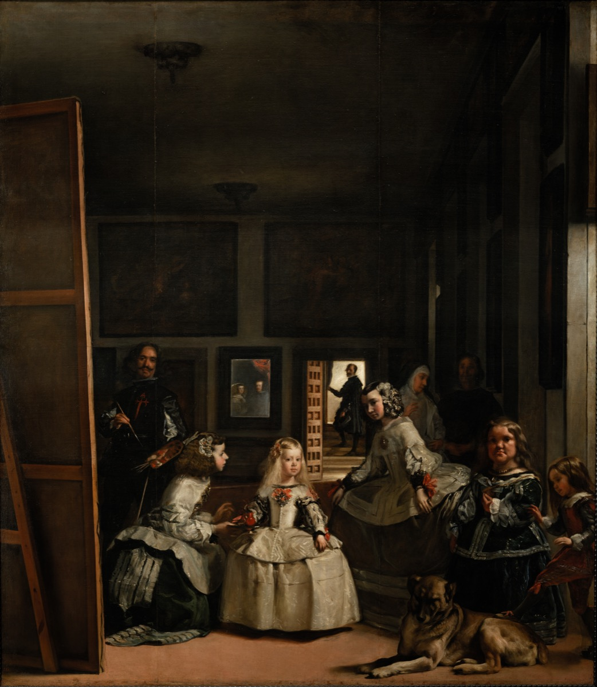
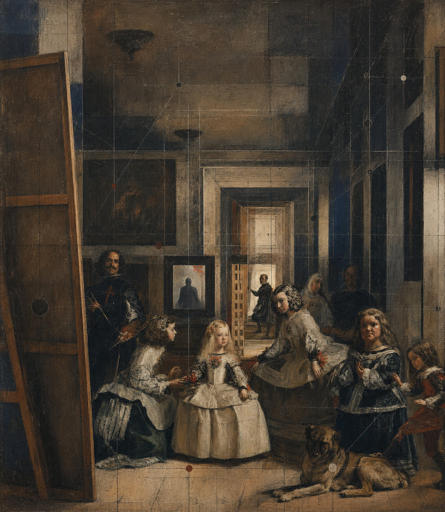
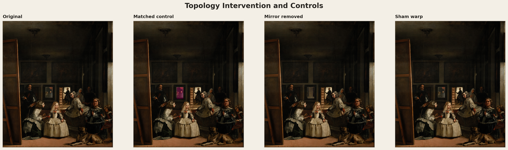
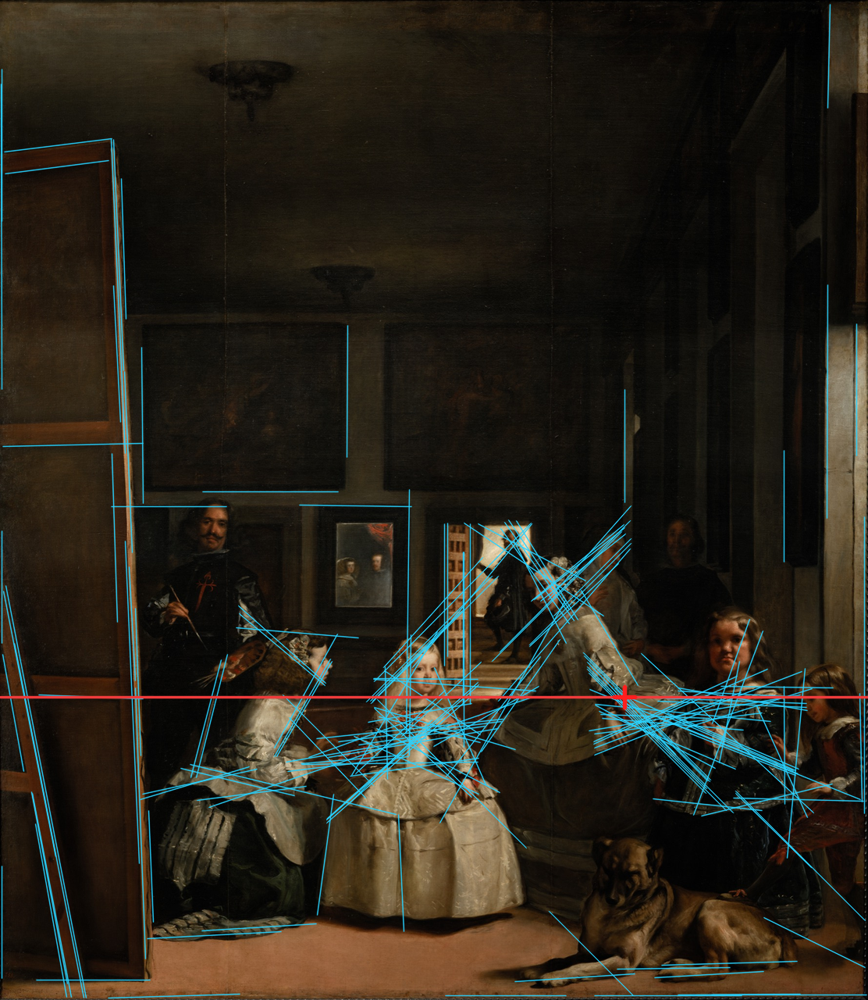
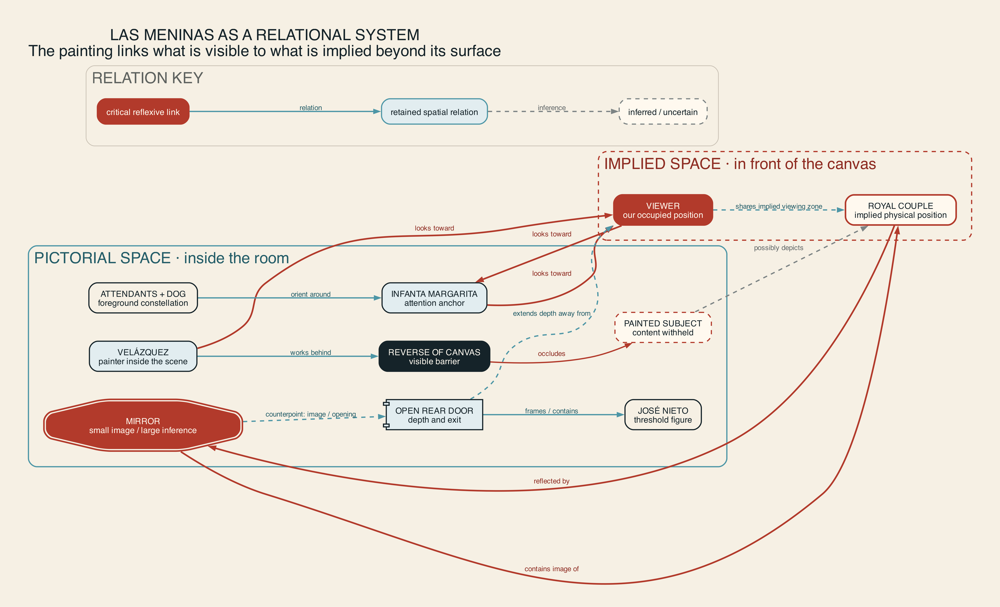
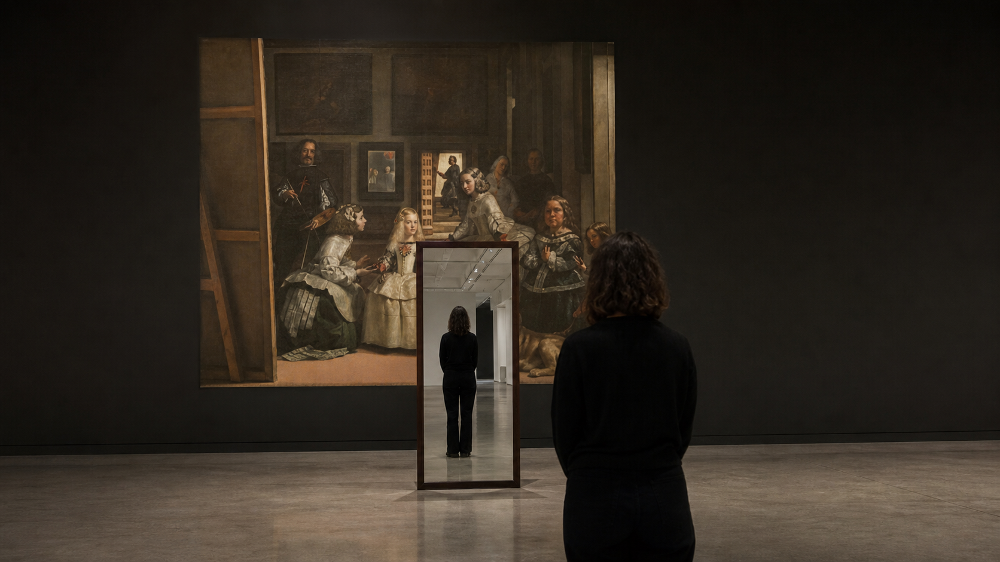
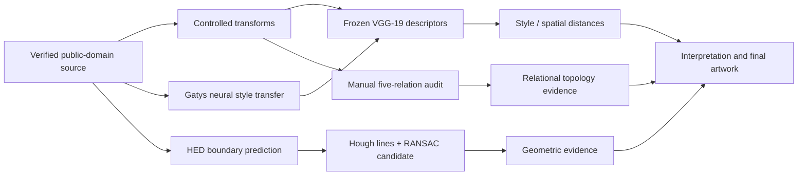

# Entering *Las Meninas*: How a Painting Changed the Way I Look at Art

> A reproducible study of style, geometry, and relational topology in Diego Velázquez's *Las Meninas*—using CNNs as measuring instruments, not as automatic art historians.

This final project for **Art, Geometry, and Cognition** asks a deliberately narrow question: if a neural network separates an image into feature statistics, spatial activations, and boundaries, what becomes clearer about a painting—and what remains outside the model?

The answer is not that a CNN “understands” *Las Meninas*. The experiments instead make three visual layers independently inspectable:

1. **style**, operationalized as multi-layer VGG-19 Gram statistics;
2. **geometry**, studied through controlled perspective transforms and HED–Hough–RANSAC boundary analysis;
3. **relational topology**, encoded as a small, human-audited graph connecting the mirror, painter, doorway, canvas, figures, and implied viewer.

| Public-domain source proxy | Final personal artwork: *Entering Las Meninas* |
| --- | --- |
|  |  |

**Submission materials:** [final report](report/final-report.md) · [presentation](outputs/presentation/entering-las-meninas.pptx) · [project plan](project-plan.md) · [source audit](report/sources.md) · [artwork statement](outputs/artwork/README.md)

## Core argument

*Las Meninas* changed how I look at art because it made viewing itself part of the work. Its mirror, gazes, doorway, painted canvas, and off-canvas royal position do not merely fill a rectangular surface; together they construct a system in which the viewer is implicated.

CNNs helped me see that system more clearly by forcing a separation of visual evidence. VGG-19 can measure changes in feature correlations and spatial activations. HED can expose boundaries from which geometric line candidates can be estimated. Neither model, however, identifies why the rear mirror connects the painted room to an implied viewer outside the frame. A small local edit can break that relation while barely moving the CNN distances.

The project therefore treats computation as an **analytical lens with a visible limit**. The final artwork recombines the layers the experiments separated: intensified perspective, map-like construction lines, preserved character relations, and a contemporary viewer occupying the mirror.

## 中文摘要

这是 **Art, Geometry, and Cognition** 课程的期末项目。项目没有把 CNN 当成会自动解释艺术史的“智能评论家”，而是把它当成一种测量工具：用 VGG-19 的 Gram matrix 表示模型定义的风格统计，用保留二维位置的中深层激活比较空间内容，用 HED、Hough 与 RANSAC 提取边界、直线和候选消失点，再把镜子、画家、后门、画布、人物和画外观看者编码为人工核验的关系图。

实验最重要的发现是：CNN 能够把一些视觉层次分开，但这些层次并不真正独立。100% 透视变换的 spatial RMS distance 达到 `0.9189`，而 style distance 只有 `0.1267`；最高强度的神经风格迁移同时产生 `0.5549` 的 style distance 和 `0.4822` 的 spatial RMS distance。更关键的是，删除镜中人物会切断一条重要的画内—画外关系，但其 CNN 距离与同区域的 matched control 很接近。换言之，网络对像素和特征变化有明确响应，却不会自动给出这条关系的艺术意义。

最终作品 *Entering Las Meninas* 把实验中被拆开的层重新组合：它保留原作主要关系，强化空间构造，并把镜中的皇室人物替换成当代观看者，使“谁在看、从哪里看”成为画面中可见的问题。

## Recorded results

All values below come from the frozen 22-image/21-comparison result set, using the public-domain source proxy as the reference. They are **distances from the reference**, so lower does not mean aesthetically better.

- **Style distance** is the aggregate relative Frobenius distance between VGG-19 Gram matrices at `relu1_1`, `relu2_1`, `relu3_1`, `relu4_1`, and `relu5_1`.
- **Spatial RMS distance** is the aggregate relative RMS distance between 32 × 32 pooled spatial feature maps at `relu3_1`, `relu4_2`, and `relu5_1`.
- **Relations preserved** is a separate manual visual audit of five declared relations. It is not a CNN prediction.

| Condition | Style distance | Spatial RMS distance | Relations preserved | What the condition tests |
| --- | ---: | ---: | ---: | --- |
| 0% identity baseline | **0.0000** | **0.0000** | 5/5 | Exact reference baseline; zero is defined and measured as zero |
| 100% non-neural style baseline | 0.3025 | 0.2693 | — | Deterministic color, tone, and detail manipulation |
| 100% geometry transform | **0.1267** | **0.9189** | 5/5 | Strong perspective/depth change with declared relations retained |
| Neural style transfer, strength 1.0 | **0.5549** | **0.4822** | 5/5 | Gatys optimization with a fixed VGG-19 and an original style donor |
| 100% geometry + neural style 1.0 | **0.5676** | **0.9083** | 5/5 | Combined cell of the controlled 2 × 2 experiment |
| Mirror deletion | **0.0219** | **0.0928** | **4/5** | Removes the mirror-to-outside-viewer relation |
| Matched mirror-region control | **0.0249** | **0.0843** | **5/5** | Perturbs the same area while retaining the mirrored figures |
| Picasso local comparison | **1.4196** | **1.3786** | Not scored | Optional external reconstruction; numerical result only, no image redistributed |
| Final artwork | **0.4614** | **0.8091** | **5/5** | Creative synthesis; mirror identity changes, mirror relation remains |

The mirror ablation is the conceptual center of the study. In this deterministic run, mirror deletion and its matched control remain close in both model-defined distances, even though the manual audit changes from 5/5 to 4/5. This is not a significance test and does not establish a universal CNN limitation. It demonstrates a specific representational gap under the declared VGG-19 measurement.

The Picasso row comes from an optional local comparison image. Its numerical distances are reported for completeness, but the image and activation visualizations are intentionally absent from the public repository because the reproduction rights are not established for redistribution here.

Raw values and per-layer results are available in [style-distances.csv](outputs/cnn-analysis/style-distances.csv), [spatial-distances.csv](outputs/cnn-analysis/spatial-distances.csv), and [cnn-analysis.json](outputs/cnn-analysis/cnn-analysis.json). The relation audit is available in [topology-relations.csv](data/topology-relations.csv) with a [plain-language explanation](data/topology-relations.md).

## Visual gallery

### 1. Separating geometry and style


The matrix treats geometry and style as controlled factors rather than as interchangeable visual effects. The 0% conditions are identity baselines; later CNN comparison asks how much each manipulation changes the two declared descriptors.

### 2. Controlled perspective transformation


The transform increases convergence and depth expansion around a declared vanishing-point coordinate while preserving output size. Its purpose is experimental control, not historical reconstruction.

### 3. Actual VGG-19 neural style transfer


Each strength starts from the same seeded initial state and uses the same frozen VGG-19. The style donor is an original, project-generated abstract image rather than a living artist's work or a copyrighted painting.

### 4. The mirror as a relational ablation



The target edit removes only the mirror content. The matched control modifies the same normalized region while leaving the figures readable; the sham warp provides a second local perturbation. These controls prevent “the image changed” from being mistaken for “the relation was understood.”

### 5. What the CNN activates


The heatmaps show channel-energy summaries, not individual neurons and not brain activity. Deeper layers change the scale and location of response, but the maps do not label mirrors, identities, or social roles.

### 6. CNN boundaries and geometric estimation



The recorded run used the Xie–Tu HED fusion output, detected line candidates with a probabilistic Hough transform, and estimated a dominant intersection candidate with length-weighted RANSAC. A parallel Canny control and explicit evidence grades keep this geometric estimate auditable.

### 7. Human-declared relation graph



This graph is an operational interpretation supplied by the project, not an automatic scene graph inferred by VGG or HED. The distinction is essential: computation measures the image; the relation graph states what this project asks the measurements to test.

### 8. Ready-made proposal: *The Missing Viewer*



The ready-made is an ordinary mirror aligned with the painting's implied viewing axis. The image above is explicitly an **AI-generated concept mockup**, not documentation of a physically installed exhibition. It turns the painting's off-canvas position into a place a present-day viewer can occupy.

## Method



### Source and preprocessing

The master input is the 26,065 × 30,000-pixel public-domain digital image of Velázquez's 1656 painting from Wikimedia Commons. The download script verifies the exact file with SHA-256:

```text
dd0cab7a6bebcee8c492f3181b324b91df8a8f23f1794dcfae45e454efa3fda0
```

The 266.9 MB master is not committed to Git. The pipeline uses bounded JPEG decoding to avoid expanding the full 781-million-pixel image in memory, then creates an aspect-preserving 2,048-pixel working proxy. See [data/README.md](data/README.md) for provenance and derived-file hashes.

### Controlled transformations

- **Geometry:** five deterministic perspective/depth levels (`0`, `25`, `50`, `75`, `100`) around a declared normalized vanishing point.
- **Non-neural style baseline:** five deterministic color/tone/detail levels, clearly labeled as traditional image processing rather than CNN output.
- **Neural style:** three Gatys/VGG-19 optimization strengths (`0.25`, `0.50`, `1.00`), each optimized for 500 steps from the same seeded initialization.
- **Topology controls:** original, mirror deletion, same-region matched control, and sham warp.
- **Factorial comparison:** a 2 × 2 matrix crossing style and geometry to avoid treating them as one undifferentiated “AI effect.”

Every transformation writes a manifest containing parameters, input paths, and output paths.

### CNN representation analysis

Torchvision's ImageNet-pretrained VGG-19 is frozen and used only as a feature extractor. Images are aspect-preservingly letterboxed to 512 × 512 and normalized with the documented ImageNet mean and standard deviation.

- Gram matrices summarize channel co-activation and serve as a deliberately limited style descriptor.
- Adaptive 32 × 32 pooling retains a coarse spatial grid for content/spatial comparison.
- Channel RMS maps visualize where aggregate activation energy occurs at six depths.
- Cached descriptors are keyed by image bytes, model configuration, and preprocessing metadata; large tensor caches are rebuildable and excluded from Git.

### Boundary and line analysis

The primary geometry path uses the original pretrained HED model by Xie and Tu. Its model and network-definition files are downloaded at runtime and checksum-verified. Hough line extraction and length-weighted RANSAC operate on the CNN edge map; Canny runs in parallel as a non-neural control. If `--geometry-backend auto` cannot obtain HED, the script records the reason before using its declared VGG fallback.

### Relational topology

The topology layer is a manual, predeclared graph of five qualitative relations:

1. the rear mirror connects the painted room to an implied outside viewing position;
2. the painter faces that outside position;
3. the rear doorway contains José Nieto;
4. the large canvas occludes the left side of the room;
5. Infanta Margarita is surrounded by attendants.

This is inspired by the organizing idea of a cognitive map, but it is **not** a measurement of a viewer's hippocampus, a proof of mathematical topology, or an automatically learned neural scene graph.

## Quick start

The repository includes the compact source proxy, final figures, metrics, manifests, report, and presentation. Reading the results requires no model download:

```bash
git clone https://github.com/Mike-Zhuang/entering-las-meninas.git
cd entering-las-meninas
```

Start with the [final report](report/final-report.md), the [presentation](outputs/presentation/entering-las-meninas.pptx), or the gallery above.

To run the automated tests without rebuilding the image analysis:

```bash
python3.12 -m venv .venv
source .venv/bin/activate
python -m pip install --upgrade pip
python -m pip install -e '.[dev]'
python -m pytest -q
```

The declared runtime range is Python 3.11–3.13. The recorded full run used Python 3.12, PyTorch/Torchvision, Apple MPS, fixed seed `139`, a 512-pixel VGG input, and a 512-pixel neural-style working image. CPU execution is supported but substantially slower.

## Full formal reproduction

The command below downloads and verifies the master image, obtains model weights on first use, rebuilds every controlled transformation, runs both neural analyses plus the two disclosed ROI-sensitivity checks, regenerates quantitative tables and figures, produces the parallax animation, and validates required artifacts:

```bash
python3.12 -m venv .venv
source .venv/bin/activate
python -m pip install --upgrade pip
python -m pip install -e '.[dev]'

./scripts/download-source-image.sh

PYTHON_EXECUTABLE="$PWD/.venv/bin/python" \
  ./scripts/run-full-pipeline.sh \
  --device auto \
  --geometry-backend auto \
  --style-steps 500 \
  --style-long-side 512 \
  --cnn-image-size 512 \
  --seed 139 \
  --force-cnn

python -m pytest -q
python scripts/validate-artifacts.py \
  --project-root "$PWD" \
  --output-root "$PWD/outputs" \
  --write-report "$PWD/outputs/pipeline-validation.json"
```

Before committing a public release, run the repository-specific rights and file-scope guard after Git initialization:

```bash
./scripts/check-public-release.sh
```

Useful lower-cost checks:

```bash
# Print the complete pipeline without downloading models or generating images.
./scripts/run-full-pipeline.sh --dry-run --skip-download

# Reuse cached VGG descriptors by omitting --force-cnn.
PYTHON_EXECUTABLE="$PWD/.venv/bin/python" ./scripts/run-full-pipeline.sh
```

The first complete run requires network access and several gigabytes of free disk space. The source image is approximately 267 MB, VGG-19 weights approximately 548 MB, and the HED model approximately 56 MB; generated figures, activations, videos, and temporary caches add further storage. Neural style optimization is the slowest stage.

## Repository structure

```text
.
├── assets/                     # Original style donor, concept mockup, prompts, relation graphs
├── data/
│   ├── processed/              # Compact public-domain source proxy
│   ├── topology-relations.csv  # Manual five-relation audit
│   └── README.md               # Provenance and checksums
├── outputs/
│   ├── artwork/                # Final artwork and statement
│   ├── cnn-analysis/           # VGG distances, activation maps, and manifest
│   ├── figures/                # Submission-ready comparative figures
│   ├── geometry-analysis/      # HED/Canny, Hough, and RANSAC evidence
│   ├── neural-style-transfer/  # Gatys outputs and loss histories
│   ├── neural-style-transfer-combined/ # Gatys output from the 100% geometry cell
│   ├── presentation/           # Final slide deck
│   └── transformations/        # Geometry, style-baseline, and topology variants
├── report/                     # Final report, evidence audit, and references
├── scripts/                    # Download, orchestration, validation, and release checks
├── src/                        # Analysis, transformation, and visualization code
├── tests/                      # Unit and release-safety tests
├── CITATION.cff
├── LICENSE
└── THIRD-PARTY-NOTICES.md
```

Rebuildable model weights, raw source data, tensor descriptor caches, and unverified local research images are intentionally excluded from version control.

## Artifact index

| Artifact | Purpose |
| --- | --- |
| [Final report](report/final-report.md) | Complete argument, method, results, reflection, and references |
| [Presentation](outputs/presentation/entering-las-meninas.pptx) | Submission-ready course presentation |
| [Final artwork](outputs/artwork/entering-las-meninas-final.png) | Creative synthesis of the experimental findings |
| [Artwork statement](outputs/artwork/README.md) | Visual decisions, generation method, prompt, hash, and disclosure |
| [Ready-made mockup](assets/installation/the-missing-viewer-mockup.png) | Concept visualization for *The Missing Viewer* |
| [CNN analysis JSON](outputs/cnn-analysis/cnn-analysis.json) | Full VGG configuration, runtime, hashes, and per-condition results |
| [Style distance table](outputs/cnn-analysis/style-distances.csv) | Per-layer and aggregate Gram distances |
| [Spatial distance table](outputs/cnn-analysis/spatial-distances.csv) | Per-layer and aggregate spatial-feature distances |
| [Topology audit](data/topology-relations.csv) | Human review of the five declared relations |
| [Neural-style manifest](outputs/neural-style-transfer/manifest.json) | Inputs, losses, 500-step settings, device, seed, and output hashes |
| [Combined-cell manifest](outputs/neural-style-transfer-combined/manifest.json) | Independent neural-style run beginning from the 100% geometry condition |
| [Transformation manifest](outputs/transformations/transformations-manifest.json) | Every controlled image-processing condition and parameter |
| [Evidence and citation audit](report/sources.md) | Claim boundaries and primary/official sources |
| [Third-party notices](THIRD-PARTY-NOTICES.md) | Rights, provenance, runtime models, and redistribution boundaries |

## Public materials, licensing, and AI disclosure

### Velázquez source image

The source is the high-resolution Wikimedia Commons file *Las Meninas, by Diego Velázquez, from Prado in Google Earth*. Commons marks the faithful reproduction of this public-domain painting as public domain. The master file is downloaded rather than committed because of its size; two reduced proxies and transformations derived from that source are included with full provenance. Public-domain status can vary by jurisdiction, so users should consult the complete Commons rights statement.

### Picasso comparison

The public repository does **not** redistribute the Picasso reproduction, a crop of it, its CNN input image, or an activation overlay. Museu Picasso Barcelona identifies the reproduction rights as Sucesión Picasso / VEGAP. The table retains only numerical distances produced during an optional local comparison. Reproducing that row requires the user to supply a lawfully obtained local image; it is not part of the canonical public pipeline.

### Generated visual assets

Three visual assets were made with the Codex image-generation tool from project-authored prompts:

- `assets/style/cognitive-map-style-reference.png`, the original abstract style donor;
- `assets/installation/the-missing-viewer-mockup.png`, an explicitly labeled concept mockup;
- `outputs/artwork/entering-las-meninas-final.png`, the final personal artwork generated as an edit of the public-domain source.

The exact prompts, purposes, SHA-256 values, and known reproducibility limits are recorded in [assets/README.md](assets/README.md) and the [artwork statement](outputs/artwork/README.md). These assets are not presented as CNN experiment outputs. The image-generation tool did not return a model version or seed, so the prompts document intent but cannot guarantee pixel-identical regeneration.

### License boundary

The [MIT License](LICENSE) applies only to project-authored source code, tests, shell scripts, and software configuration. It does not automatically license images, artworks, reports, slides, course materials, third-party model weights, or external references. [THIRD-PARTY-NOTICES.md](THIRD-PARTY-NOTICES.md) is the controlling repository-level audit of those boundaries. Runtime VGG-19 and HED weights remain governed by their upstream terms.

## Limitations

- **Model-specific evidence:** VGG-19 is trained on ImageNet photographs, not on seventeenth-century painting, art history, or human neuroscience. Results should not be generalized to every CNN.
- **No pure style/geometry split:** Gram matrices discard explicit spatial arrangement, while pooled spatial features can still respond to color and texture. The two distance scales are not directly commensurable.
- **Boundaries are not meaning:** HED predicts visual boundaries. Hough and RANSAC estimate line structure. None of them identifies a reflected person or explains the mirror's role.
- **Manual topology:** The five-relation graph is a declared analytical coding scheme. It is not automatically discovered, exhaustive, or a theorem about mathematical topology.
- **No human-participant study:** The project compares model representations with an explicit visual audit; it does not measure viewers' perception, memory, gaze, or neural activity.
- **Single controlled run:** The mirror comparison is deterministic and useful as a case study, but it supplies no sampling distribution or statistical significance test.
- **Transformation side effects:** Even controlled homographies and Gatys optimization can change multiple low-level cues. The measured cross-effects are part of the result, not evidence of perfect disentanglement.
- **Creative output is separate evidence:** The final artwork and installation mockup answer the experiment artistically. They are not additional validation samples.
- **Restricted comparison:** Picasso is retained only as a numerical, optional local comparison, which limits public end-to-end reproduction of that one row.

## Citation and references

If this repository is used in another project, cite the software metadata in [CITATION.cff](CITATION.cff) and separately credit the original artwork, model methods, and relevant scholarship.

Core sources:

- Museo Nacional del Prado, [*The Family of Felipe IV, or Las Meninas*](https://www.museodelprado.es/en/the-collection/art-work/the-family-of-felipe-iv-or-las-meninas/9fdc7800-9ade-48b0-ab8b-edee94ea877f).
- Wikimedia Commons, [high-resolution public-domain source file](https://commons.wikimedia.org/wiki/File:Las_Meninas,_by_Diego_Vel%C3%A1zquez,_from_Prado_in_Google_Earth.jpg).
- Simonyan and Zisserman, [*Very Deep Convolutional Networks for Large-Scale Image Recognition*](https://arxiv.org/abs/1409.1556).
- Gatys, Ecker, and Bethge, [*Image Style Transfer Using Convolutional Neural Networks*](https://openaccess.thecvf.com/content_cvpr_2016/html/Gatys_Image_Style_Transfer_CVPR_2016_paper.html).
- Xie and Tu, [*Holistically-Nested Edge Detection*](https://openaccess.thecvf.com/content_iccv_2015/html/Xie_Holistically-Nested_Edge_Detection_ICCV_2015_paper.html).
- Geirhos et al., [*ImageNet-trained CNNs are biased towards texture; increasing shape bias improves accuracy and robustness*](https://openreview.net/forum?id=Bygh9j09KX).
- Tolman, [*Cognitive Maps in Rats and Men*](https://doi.org/10.1037/h0061626).
- Museu Picasso Barcelona, [Picasso's 1957 *Las Meninas* collection record](https://museupicassobcn.cat/en/collection/artwork/las-meninas-9).

The complete claim-to-source map, quotation limits, and method-specific writing boundaries are in [report/sources.md](report/sources.md).
