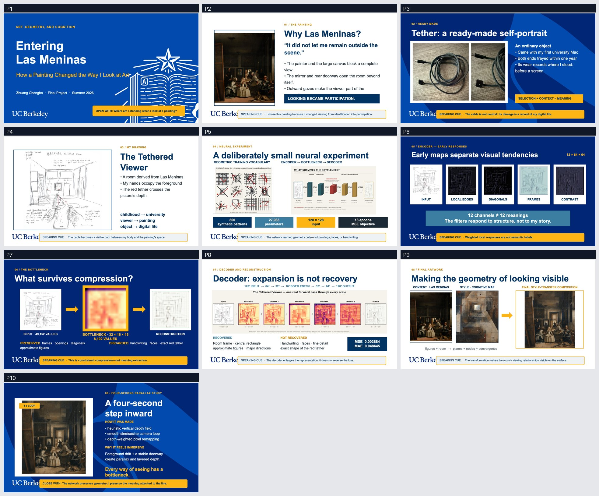
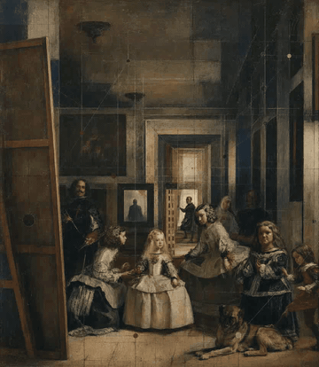

# Entering *Las Meninas*

## How a Painting Changed the Way I Look at Art



> **Every way of seeing has a bottleneck.**

## Start here

This repository documents a course final that moves from Velázquez's *Las Meninas* to a worn-cable ready-made, the drawing *The Tethered Viewer*, a small geometric autoencoder, a final transformed artwork, and a four-second parallax study. The main technical finding is that the autoencoder preserves recurring geometry more reliably than handwriting, faces, the exact red tether, or the personal history attached to it.

**Primary submission:** [open the editable 10-minute PowerPoint](entering-las-meninas-10-minute-presentation.pptx). The complete English script is stored in its speaker notes. For the code and results, open the [English autoencoder report](OH_Programming/submission/README-en.md).

这是我在 UC Berkeley **Art, Geometry, and Cognition** 课程中的期末项目。项目从委拉斯开兹的 *Las Meninas* 出发，经过一件磨损充电线 ready-made、个人绘画 *The Tethered Viewer*、一个小型几何自编码器实验、最终风格转换作品和四秒视差动画，追问同一个问题：**图像被观看、转换和压缩后，什么会留下，什么会消失？**

## 老师请从这里开始

| 优先级 | 文件 | 内容 |
| --- | --- | --- |
| 1 | **[10 分钟最终演示 PPTX](entering-las-meninas-10-minute-presentation.pptx)** | 英文、10 页、所有文字可编辑；完整讲稿在 PowerPoint speaker notes 中 |
| 2 | [演示源工程](entering-las-meninas-10-minute-presentation/README.md) | 10 页 PPTD、媒体素材、QA 总览、历史导出和讲稿 |
| 3 | [几何自编码器实验](OH_Programming/README.md) | 汇报中神经网络部分的代码、模型、输出与中英文说明 |
| 4 | [英文实验说明](OH_Programming/submission/README-en.md) | 面向课程提交的完整英文方法与结果 |
| 5 | [仓库导览](REPOSITORY-GUIDE.md) | 主项目、支持实验、扩展研究和早期作业的边界 |

## 一条完整的项目主线

| 阶段 | 主要产物 | 它在项目中的作用 |
| --- | --- | --- |
| 1. 原作 | [*Las Meninas* 参考图](outputs/reference/las-meninas-reference.jpg) | 镜子、后门、画布和人物视线使观看者不再置身画外 |
| 2. Ready-made | [磨损的充电线](entering-las-meninas-10-minute-presentation/media/tether-overall.jpg) | `Tether` 把日常使用痕迹变成一件自画像式物件 |
| 3. 个人绘画 | [*The Tethered Viewer*](OH_Programming/My_Own_Work.png) | 线缆成为穿过房间纵深、连接身体经验与绘画空间的红线 |
| 4. 神经实验 | [编码器—瓶颈—解码器](OH_Programming/outputs/07-paper-style-architecture.png) | 观察哪些视觉结构能穿过一个受限的压缩表示 |
| 5. 最终作品 | [*Entering Las Meninas*](outputs/artwork/entering-las-meninas-final.png) | 把人物关系、透视、节点和认知地图式结构重新组合 |
| 6. 动态研究 | [四秒视差循环](entering-las-meninas-10-minute-presentation/media/parallax-loop.gif) | 用前景漂移与稳定后门制造“向画内迈一步”的感觉 |

## 神经网络实验

汇报的技术中心是 `OH_Programming/` 中的小型卷积自编码器，而不是一个宣称能够理解艺术史的大模型。

```text
800 张程序生成的几何图案
        ↓
三层卷积编码器
3 × 128 × 128 → 12 × 64 × 64 → 24 × 32 × 32
        ↓
32 × 16 × 16 bottleneck
        ↓
三层转置卷积解码器
24 × 32 × 32 → 12 × 64 × 64 → 3 × 128 × 128
        ↓
重建 The Tethered Viewer
```

| 配置 | 数值 |
| --- | ---: |
| 合成训练图案 | 800 |
| 可训练参数 | 27,983 |
| 训练轮数 | 18 |
| 输入 | 3 × 128 × 128 |
| 瓶颈 | 32 × 16 × 16 |
| 损失函数 | MSE |
| 随机种子 | 139 |


实验没有把网络通道解释成“镜子通道”或“意义通道”。结果更克制：网络较好地保留了房间框架、开口、对角线和大致人物位置，却没有恢复手写文字、面孔、精细边缘和红色系绳的准确形状。

> **The encoder compresses recurring visual patterns, not the personal significance I attach to them.**

## 最终作品与动态结果

| 最终静态作品 | 四秒视差研究 |
| --- | --- |
|  |  |

最终作品把 *Las Meninas* 的人物与房间关系、原创 cognitive-map 风格参考中的平面和节点、以及项目对观看位置的思考合并起来。动画使用启发式纵向深度场、平滑正余弦相机轨迹和按深度加权的像素重映射；它不是三维重建，而是一项克制的二维 parallax study。

## 仓库层级

### 主项目：与最终演示完全一致

- `entering-las-meninas-10-minute-presentation.pptx`：老师首先打开的最终演示。
- `entering-las-meninas-10-minute-presentation/`：PPTD 源文件、媒体、QA、讲稿和历史版本。
- `OH_Programming/`：几何自编码器训练、逐层输出、模型权重、提交 notebooks 和全部单图。
- `outputs/artwork/`、`outputs/video/`：最终作品与动态输出。

### 支持实验：解释最终视觉处理

- [`style_transfer/`](style_transfer/README.md)：独立的 VGG-19 风格迁移代码、输入、三档强度结果、提示词和最终作品记录。

### 扩展研究：保留但不与主项目争夺入口

- [`EXTENDED-CNN-STUDY.md`](EXTENDED-CNN-STUDY.md)：原根 README 的完整研究叙事。
- `src/`、`scripts/`、`tests/`、`report/`、`outputs/figures/`：VGG-19、HED、几何变换、镜像消融和关系图等扩展分析。
- `outputs/presentation/` 与 `presentation/`：早期扩展研究演示及其构建脚本。

更完整的目录用途和保留理由见 [REPOSITORY-GUIDE.md](REPOSITORY-GUIDE.md)。

## 复现实验

核心自编码器代码保留在原路径 `OH_Programming/`，因为模型、notebook 和导出脚本都依赖该目录内的相对位置。

```bash
cd OH_Programming
python -m pip install -r requirements.txt
python autoencoder-experiment.py
python network-visualization.py
python export-individual-images.py
```

脚本使用固定随机种子 `139`，优先使用 Apple MPS，并在 MPS 不可用时回退到 CPU。`network-visualization.py` 生成自动结构图时还需要 Graphviz。

## 研究边界

- 自编码器从合成几何图案学习重建，不曾在 *Las Meninas* 或 *The Tethered Viewer* 上训练。
- `bottleneck` 的通道是数值表示，不是可直接命名的语义概念。
- MSE、MAE 和 feature maps 描述模型行为，不评价艺术质量。
- 风格迁移、扩展 VGG 分析和镜像关系消融是支持或延伸实验，不是 10 分钟课堂汇报的技术中心。
- MIT 许可证只覆盖项目自写代码；图像、课程材料、模型权重和第三方资产的边界见 [THIRD-PARTY-NOTICES.md](THIRD-PARTY-NOTICES.md)。
