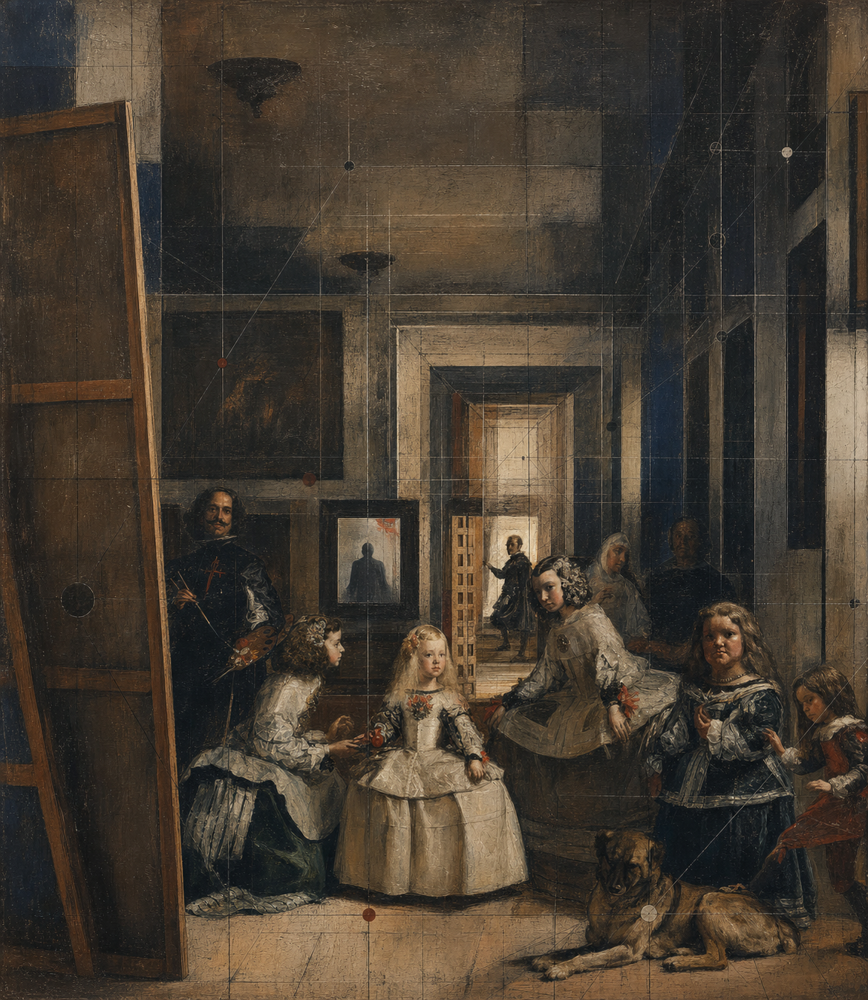
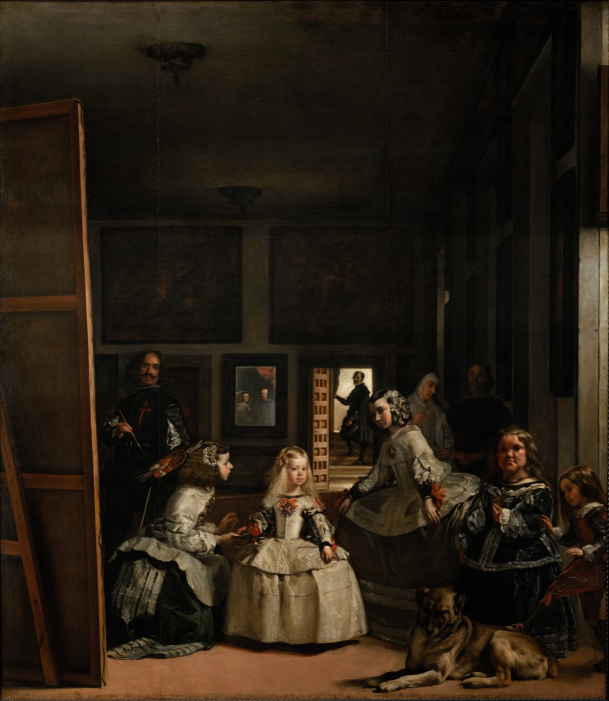
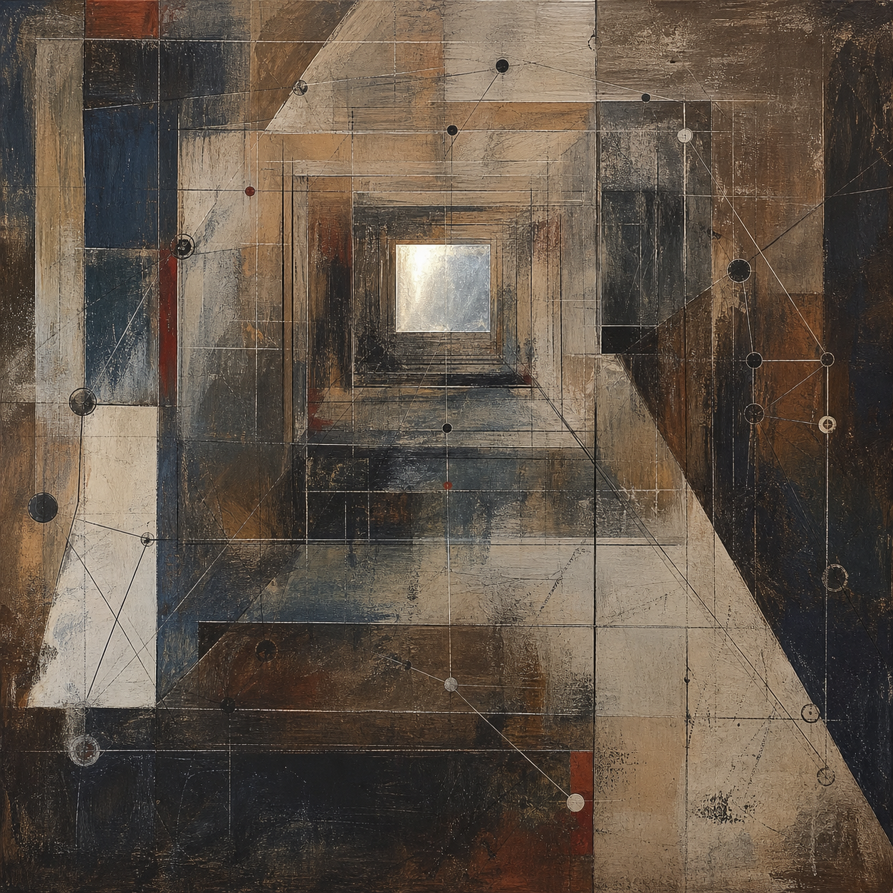
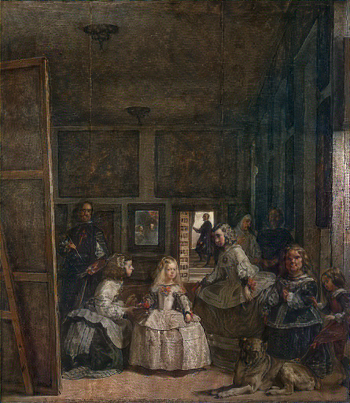
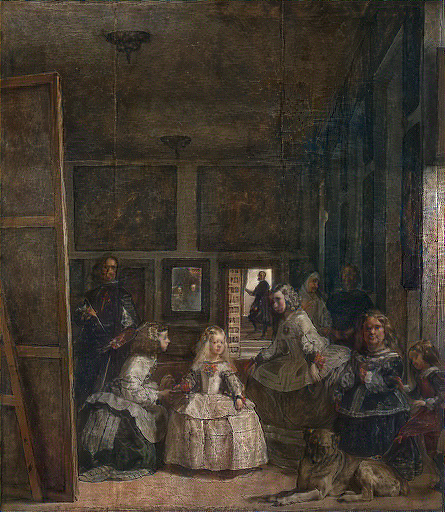
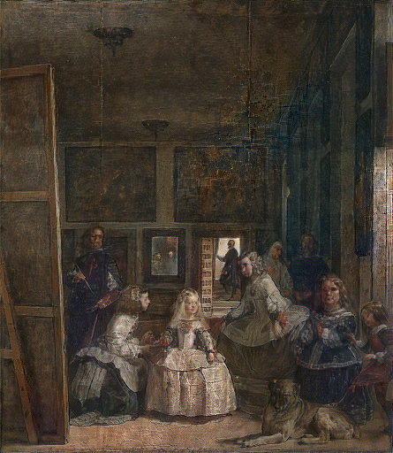

# *Entering Las Meninas*: A Neural Style-Transfer Workflow

This self-contained folder presents the complete visual workflow behind *Entering Las Meninas*. It combines controlled VGG-19 style-transfer studies with a final style-guided transformation built from the same painting and the same original cognitive-map reference.

## Final Artwork



The final artwork reorganizes Diego Velázquez’s *Las Meninas* as a visible cognitive and relational map. The painter, Infanta, attendants, dog, large canvas, mirror, and rear doorway remain recognizable, preserving the painting’s central relational structure. At the same time, the room’s perspective is intensified through charcoal construction lines, nested frames, translucent planes, and sparse nodes. A contemporary viewer silhouette occupies the rear mirror, making the implied position outside the original painting visible within the transformed scene.

The final image brings together the central discoveries of the experiments: style can be represented through multiscale texture statistics, geometry can be clarified through receding planes and nested frames, and topology can be preserved even when individual visual elements are transformed.

The complete transformation prompt is documented in [`final-artwork-prompt.md`](final-artwork-prompt.md).

## Source and Style Inputs

| *Las Meninas* | Original cognitive-map style reference |
| --- | --- |
|  |  |

The cognitive-map reference is an original project asset. It was designed as an abstract separation of style, geometry, and relational topology rather than as an imitation of a named artist. Its complete generation prompt is recorded in [`style-reference-prompt.md`](style-reference-prompt.md).

Two resolutions of the same public-domain painting are included:

- `inputs/las-meninas-final-edit-target.jpg` is the working proxy used for the final transformation.
- `inputs/las-meninas-content.jpg` is the higher-resolution content image used for the controlled VGG-19 studies.

## Controlled VGG-19 Studies

| Style strength 0.25 | Style strength 0.50 | Style strength 1.00 |
| --- | --- | --- |
|  |  |  |

These three images examine how the transformation changes as the style constraint becomes stronger. All runs begin from the same seeded initial state and use 500 Adam updates. The strength parameter changes only the weight of the style loss, making the sequence a controlled comparison of color, texture, and spatial structure.

The frozen ImageNet-pretrained VGG-19 represents:

1. content through the `relu4_2` activation of *Las Meninas*;
2. style through Gram matrices at `relu1_1`, `relu2_1`, `relu3_1`, `relu4_1`, and `relu5_1`;
3. visual smoothness through total-variation loss.

The three strength studies establish a technical continuum. The final artwork then carries the selected palette, texture, perspective, and relational ideas into a resolved composition.

## Workflow

```text
Las Meninas ──────────────> content and relational structure
       │
       ├── frozen VGG-19 ─> content features + multiscale style statistics
       │                         │
       │                         └── controlled strength studies
       │                                  0.25 / 0.50 / 1.00
       │
Cognitive-map reference ─> palette + texture + geometry + topology
       │
       └──────────────────> final style-guided transformation
                                      │
                                      └── Entering Las Meninas
```

This arrangement makes both the neural-network mechanism and the artistic decision-making visible. The VGG-19 sequence shows how style strength behaves as a controlled variable; the final image synthesizes those observations into a single finished artwork.

## Running the VGG-19 Study

### Environment

- Python 3.11–3.13
- PyTorch 2.5+
- Torchvision 0.20+
- NumPy
- Pillow

Install the dependencies:

```bash
python -m venv .venv
source .venv/bin/activate
python -m pip install -r requirements.txt
```

On the first full run, Torchvision downloads the ImageNet-pretrained VGG-19 weights. Apple Silicon systems use MPS when available; other environments fall back to the CPU. Running all three 500-step optimizations on the CPU may take a considerable amount of time.

From this folder, run:

```bash
python neural-style-transfer.py
```

New results are written to `generated/` by default, so the included project results are not overwritten. The complete command for the controlled study is:

```bash
python neural-style-transfer.py \
  inputs/las-meninas-content.jpg \
  --style-image inputs/cognitive-map-style-reference.png \
  --output-dir generated \
  --style-strengths 0.25,0.5,1.0 \
  --long-side 512 \
  --steps 500 \
  --learning-rate 0.02 \
  --content-weight 1.0 \
  --style-weight 1000000 \
  --tv-weight 0.0001 \
  --initial-noise 0.02 \
  --seed 139 \
  --device auto \
  --weights default
```

For a quick pipeline check:

```bash
python neural-style-transfer.py \
  --output-dir generated-smoke-test \
  --style-strengths 0.25 \
  --long-side 128 \
  --steps 2 \
  --overwrite
```

## Folder Structure

```text
style_transfer/
├── README.md
├── neural-style-transfer.py          # Complete Gatys/VGG-19 implementation
├── requirements.txt                  # Minimal runtime dependencies
├── style-reference-prompt.md         # Prompt for the cognitive-map reference
├── final-artwork-prompt.md            # Prompt for the final transformation
├── inputs/
│   ├── las-meninas-content.jpg       # 2048px VGG-19 content image
│   ├── las-meninas-final-edit-target.jpg
│   └── cognitive-map-style-reference.png
└── outputs/
    ├── entering-las-meninas-final.png # Final artwork
    ├── neural-style-strength-0p25.png
    ├── neural-style-strength-0p5.png
    ├── neural-style-strength-1.png
    ├── loss-strength-*.csv/json       # Per-step loss records
    └── manifest.json                  # Parameters and hashes from the VGG-19 run
```

## Reproducibility Record

- The controlled VGG-19 study uses fixed random seed 139 and records the model, parameters, input hashes, and per-step losses.
- The pretrained network is Torchvision’s `VGG19_Weights.IMAGENET1K_V1`.
- The final artwork’s exact prompt, input roles, generation date, and SHA-256 value are recorded in `final-artwork-prompt.md`.
- The final artwork has SHA-256 `6b697a5de56883ceb00a933baf759e456ffa25283268ab9f4c313f8e6e864598`.
- The source painting *Las Meninas* is in the public domain. The code license does not automatically extend to generated images or third-party model weights.
